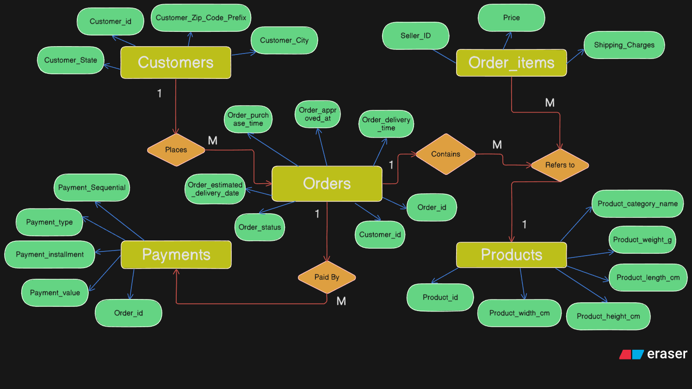
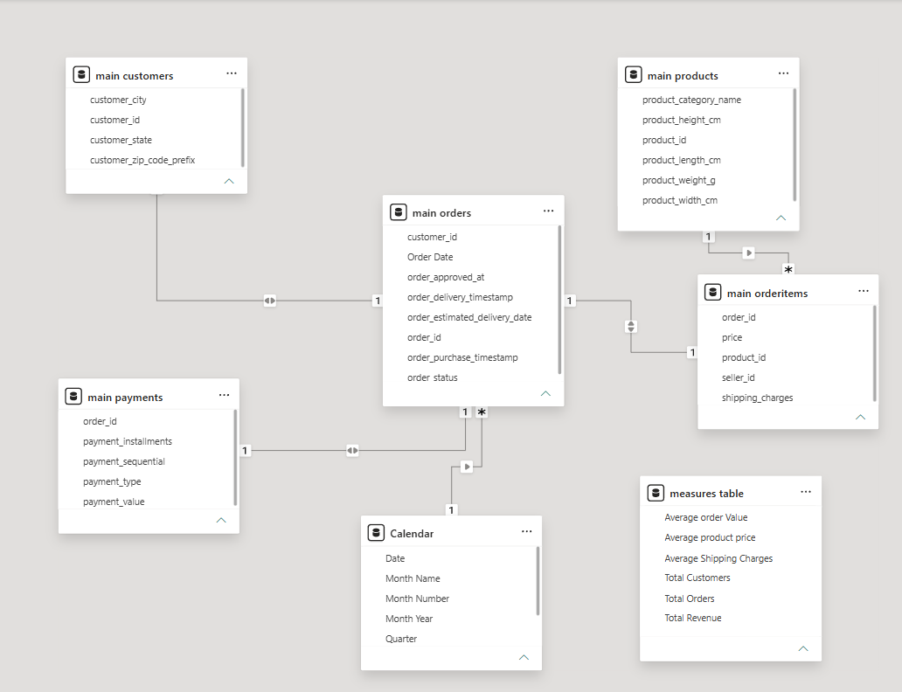

# Ecommerce Sales Analytics Dashboard

An end-to-end Data Analytics project demonstrating the complete Business Intelligence workflow—from data profiling and relational database design in PostgreSQL (NeonDB) to interactive dashboard development in Power BI.

---

## Project Overview

This project analyzes an e-commerce order & supply chain dataset to uncover business insights related to sales performance, customer behavior, product categories, payment methods, and order trends.

The project follows a complete analytics pipeline and follows ETL method:

```
Raw CSV Files
        │
        ▼
PostgreSQL (NeonDB)
(Data Profiling & Transformation)
        │
        ▼
Relational Database Design
(Primary Keys & Foreign Keys)
        │
        ▼
Power BI Data Model
        │
        ▼
DAX Measures
        │
        ▼
Interactive Dashboard
        │
        ▼
Business Insights
```

---

## Objectives

- Clean and transform raw e-commerce data using PostgreSQL (NeonDB).
- Design a relational database with appropriate constraints.
- Build a Power BI data model.
- Create reusable DAX measures.
- Develop an interactive executive dashboard.
- Generate actionable business insights.

---

## Tech Stack

| Technology | Purpose |
|------------|---------|
| PostgreSQL (NeonDB) | Data Cleaning & Database Design |
| SQL | Data Transformation |
| Power BI | Dashboard Development |
| DAX | Business Calculations |
| Git | Version Control |
| GitHub | Project Hosting |

---

# Repository Structure

```
Ecommerce-Sales-Analytics/
│
├── README.md
│
├── Dataset/
│   ├── customers.csv
│   ├── orders.csv
│   ├── orderitems.csv
│   ├── payments.csv
│   └── products.csv
│
├── SQL/
│   ├── 01_Create_Schema.sql
│   ├── 02_Create_Staging_Tables.sql
│   ├── 03_Data_Cleaning.sql
│   ├── 04_Create_Main_Tables.sql
│   ├── 05_Data_Migration.sql
│   └── 06_Data_Validation.sql
│
├── Power BI/
│   ├── Ecommerce Dashboard.pbix
│   └── DAX Measures.md
│
├── Documentation/
│   ├── ER Diagram.png
│   ├── Power BI Model.png
│
├── Dashboard Screenshots/
│   └── Dashboard.png
│
└── Insights/
    └── Business_Insights.md
```

# Database Design

The project follows a relational database approach.

Tables included:

- Customers
- Orders
- Products
- OrderItems
- Payments

### ER Diagram



```
Documentation/ER_diagram.png
```

---

# 🔗 Power BI Data Model

The dashboard uses a star-like relational model built from the PostgreSQL database.



```
Documentation/Data_model.png
```

---

# Data Cleaning

The following preprocessing steps were performed in PostgreSQL:

- Removed unnecessary columns
- Converted data types
- Handled NULL values
- Created Primary Keys
- Created Foreign Keys
- Separated staging and production schemas
- Validated data integrity

---

# Dashboard Preview


```
Dashboard Screenshots/Dashboard Overview.png
```

---

# 📊 Dashboard Features

### Executive KPIs

- Total Revenue
- Total Orders
- Total Customers
- Average Order Value

### Visualizations

- Revenue Trend
- Revenue by Product Category
- Payment Type Distribution
- Order Status Analysis
- Customer Distribution by State
- Interactive Slicers

---

# 📐 DAX Measures

The dashboard uses reusable DAX measures including:

- Total Revenue
- Total Orders
- Total Customers
- Average Order Value
- Average Product Price
- Average Shipping Charges

Detailed formulas are available in:

```
Power BI/DAX_Measures.md
```

---

# 💡 Business Insights

Some insights generated from the dashboard include:

- Revenue performance across different time periods.
- Product category contribution to total revenue.
- Customer distribution across states.
- Order status breakdown.
- Payment method preferences.

Detailed insights are available in:

```
Insights/Business_Insights.md
```

---

# 🚀 How to Run

1. Download the dataset.
2. Execute the SQL scripts in the `SQL` folder.
3. Import the cleaned tables into Power BI.
4. Open the `.pbix` file.
5. Refresh the data source if required.

---

# 📷 Project Screenshots

| Dashboard |
|-----------|
| *(Insert Dashboard Screenshot)* |

---

# 📚 Skills Demonstrated

- SQL
- PostgreSQL
- Data Cleaning
- Data Modeling
- Relational Database Design
- Power BI
- DAX
- Data Visualization
- Business Intelligence
- Dashboard Design

---

# 👨‍💻 Author

**Your Name**

LinkedIn: *(Your LinkedIn URL)*

GitHub: *(Your GitHub Profile URL)*

---

## ⭐ If you found this project helpful, consider giving it a star!
